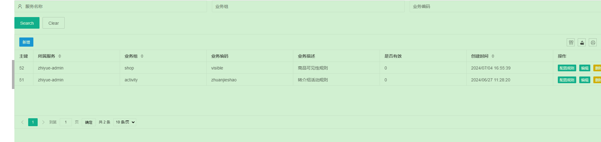
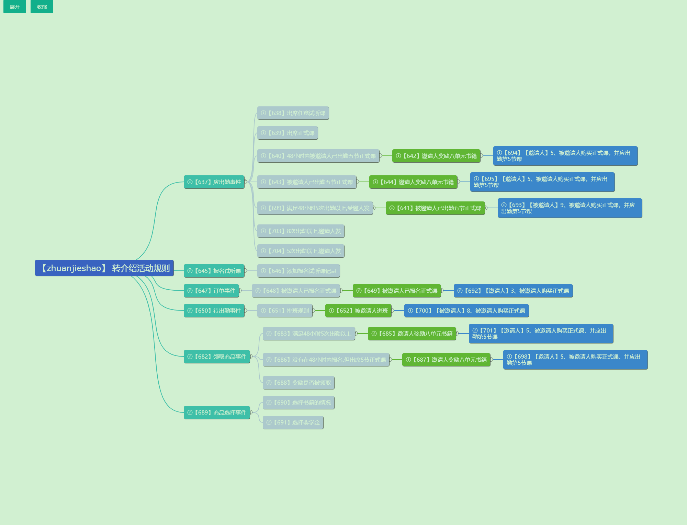
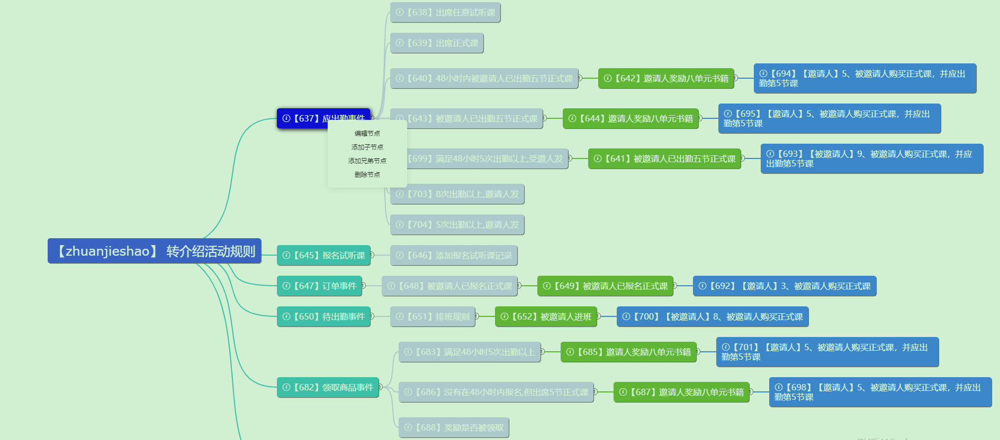
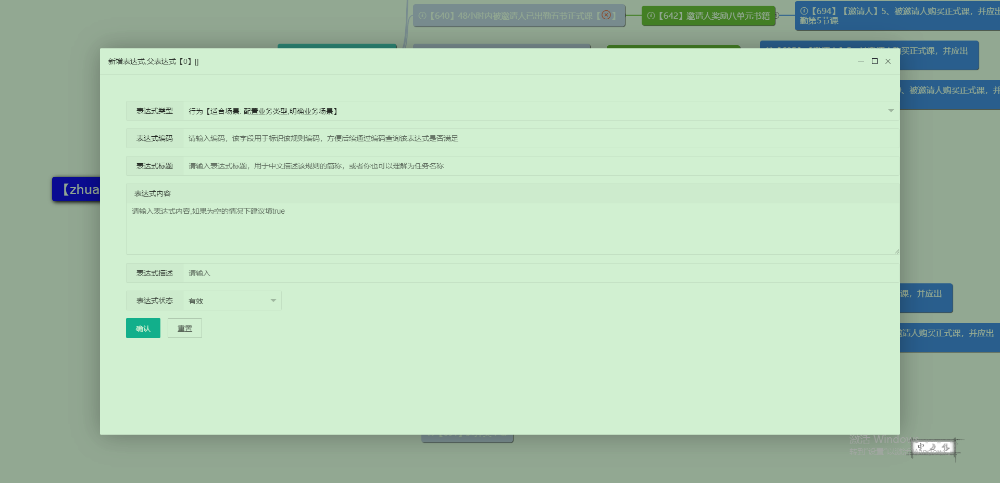
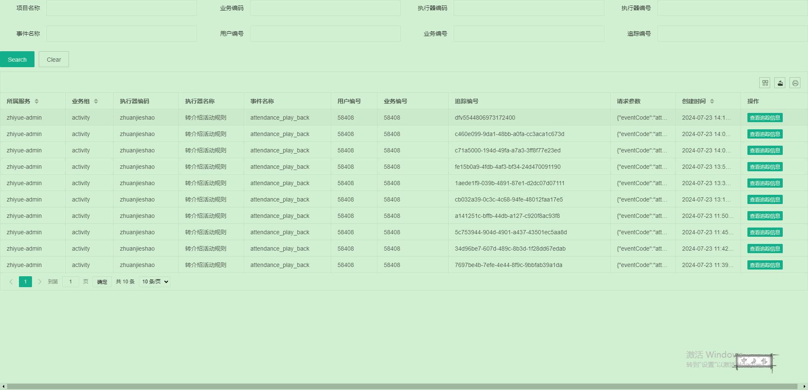
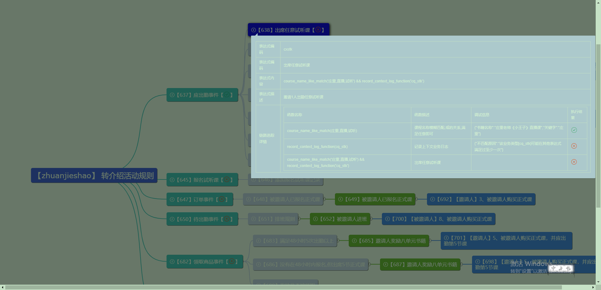
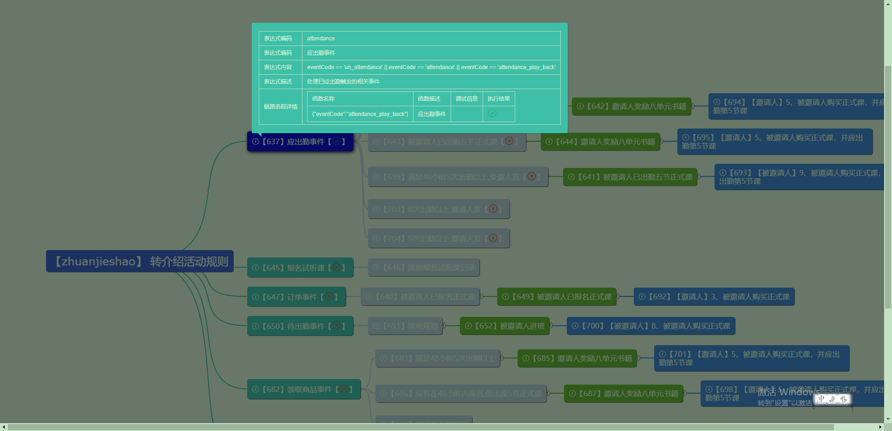
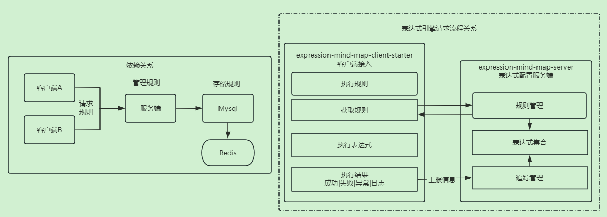

# 表达式引擎

一款基于Aviator封装可以动态配置动态函数和变量来形成表达式的引擎，可通过定义表达式、追踪、搜索等能力完成表达式的可视化处理流程，更直观、更灵活、简单高效的完成复杂的业务规则。

## 功能涵盖

- 标准化的函数定义
- 基于思维导图的可视化界面
- 支持表达式执行规则链路追踪
- 支持表达式模糊搜索能力
- 支持跨服务的调用【服务端负责规则配置、客户端负责规则的运算触发】, 支持nacos、以及指定地址
- 支持规则的导入导出功能
- 自定义能力的动态开关
- 版本支持: 支持jdk 8+,spring-boot 2.x , jdk 17 + spring-boot 3.x

> 仅依赖redis和mysql

## 应用场景

- 配置化的能力
    - 一些业务需要动态配置，时用时不用，新建字段又比较浪费
    - 开关能力: 某时某刻（时间纬度）生效，某些业务类型才能触发
    - 通用能力：是否重复、达到多少次触发、是否黑白名单内、业务告警...
    - 前置后置能力处理: 业务方法的前置拦截、参数校验、数据补全；业务方法后置处理：回调触发、短信发送、状态变更
    - 参数过滤转化: 为一些不规范的数据，做数据过滤、转换

> 以上场景都可通过设计函数或者变量来形成基础能力，通过表达式配置形成规则。

- 业务灵活重组
    - xxx: 那个功能下掉，又或者下掉5分钟，等处理完再打开？
    - xxx: 去掉其中这个规则
    - xxx: 这个功能只让特定人使用

> 通过规则管理来配置，并且实时生效

- 营销活动规则(基于异步事件驱动版本)，可视化界面基于该模型设计

    - 1、接受上游传递过来的行为事件(比如: 注册、分享、订单、评论)，【消息队列||自行定义】
    - 2、消费上游的事件与活动规则进行匹配，确定满足活动的规则【确定规则】
    - 3、行为事件匹配【确定行为】比如第一步，满足则进入该行为的规则处理。
    - 4、行为规则校验【规则过滤】
    - 5、执行业务奖励【执行逻辑】
    - 6、执行回调【触发回调】

  > 还有一些类似转介绍的场景，需要有邀请关系的等等，篇幅太长，后续单独出个文章吧，偏实际应用场景。

## 配置表达式

### 1. 执行器页面

规则列表: http://localhost:20888/template/executor-list.html

配置规则页面 :

或者选中节点，按Tab键，即可创建子节点

### 2. 链路追踪列表

【已经执行过的规则】: http://localhost:20888/template/trace-list.html

- 点击查看追踪信息【会携带追踪编号，去规则中匹配当时执行的调试日志记录】

### 流程图

#### 表达式配置玩法

##### 1. 基于执行顺序的优先级【从上到下】

- 最上层：定义通用基础属性、业务数据初始化
- 中间层：具象业务事件处理
- 最下层：通用的回调模型

##### 2. 基于业务模型的分支【从左到右】

- 业务事件确定
- 条件规则限制
- 业务逻辑触发
- 完成事件回调

------

## 其他文档

客户端接入:  [文档地址](./expression-mind-map-client-starter/README.md)

服务端接入:  [文档地址](./expression-mind-map-server/README.md)

## 其他
> 如果你对该项目有任何疑问或者建议,可直接联系我
> QQ: `444368875` , 微信: `liukaixiong820` 

## 特别鸣谢相关作者

### github

- jsmind.menu : https://github.com/allensunjian/jsmind.menu.js/blob/master/README.md
- jsmind : https://hizzgdev.github.io/jsmind/docs/zh/
- aviator: https://github.com/killme2008/aviatorscript

