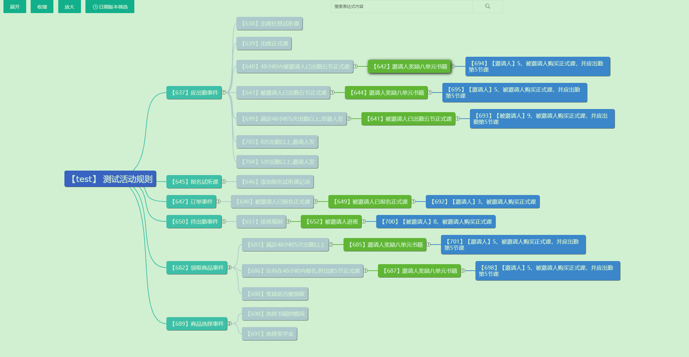
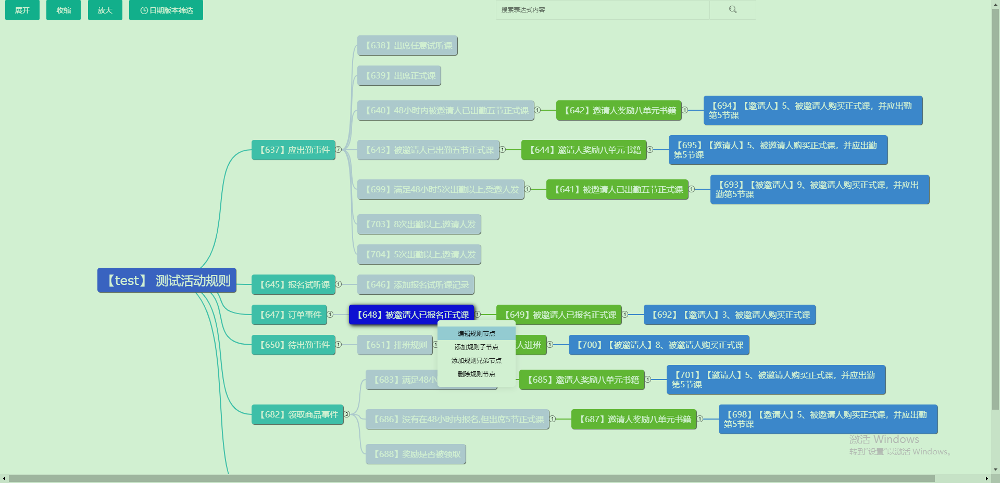
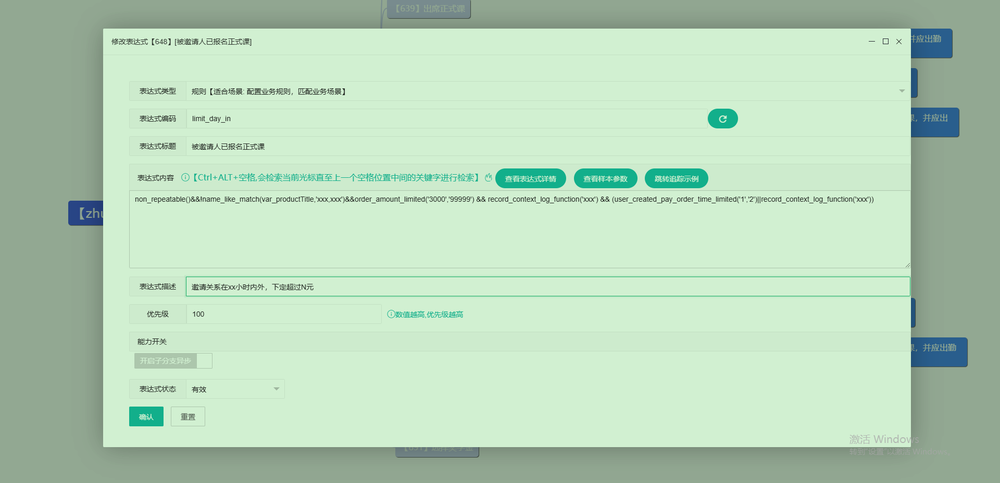
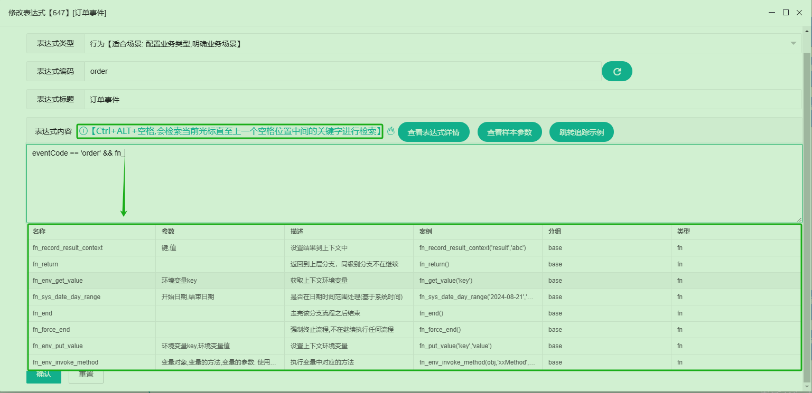
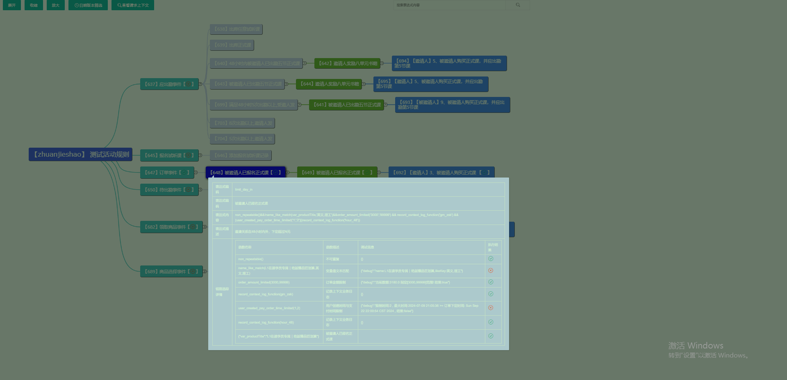
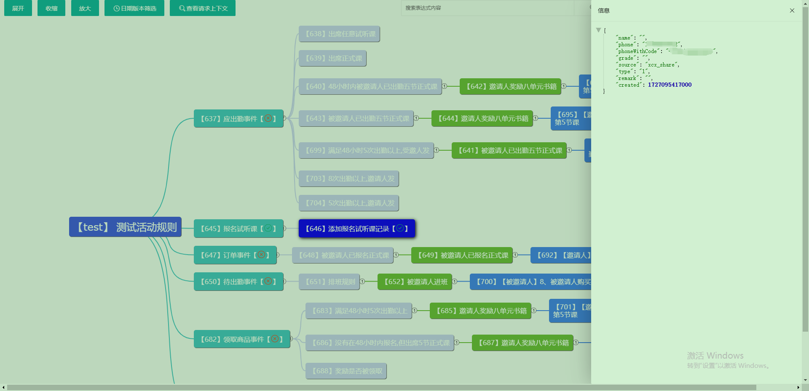

# 🚀 超灵活「表达式规则引擎」完全指南 | 动态配置+思维导图可视化+实时生效

---

一款基于`Aviator`封装可以动态配置动态函数和变量来形成表达式的引擎，可通过定义表达式、追踪、搜索等能力完成表达式的可视化处理流程，更直观、更灵活、简单高效的完成复杂的业务规则。

## 🌟 核心优势全解析

### 🔥 四大核心能力
✅ **动态编排**：无需改代码，表达式实时配置业务规则  
✅ **全链路透视**：执行过程可视化追踪、轻松定位规则执行情况  
✅ **跨服务联动**：支持Nacos注册中心/IP直连，配置与执行分离部署  
✅ **拓展能力**：支持自定义函数、动态变量，丰富的回调能力

### 🛡️ 硬核技术支撑
⚡ **双版本兼容**：JDK8+SpringBoot2.x / JDK17+SpringBoot3.x 全适配  
⚡ **轻量级依赖**：仅需MySQL+Redis，5分钟快速部署  
⚡ **企业级扩展**：自定义函数/变量+流程控制（break/return/分支跳转）

---

## 🎯 五大黄金应用场景
### 1️⃣ **动态业务管控**
✨ 活动限时开关 | 用户分层可见 | 紧急熔断机制  
✨ 数据清洗过滤 | 接口接管（前置校验→业务执行→后置回调）

### 2️⃣ **业务秒级重组**
💡 营销规则热更新（如双11满减策略实时调整）  
💡 功能模块插拔（抽奖次数限制动态下架）

### 3️⃣ **原子能力沉淀**
🔧 复用组件：黑白名单 | 重复校验 | 积分发放  
🔧 业务原子化：短信发送→告警触发→API调用→状态变更

### 4️⃣ **智能参数处理**
🎨 数据格式统一 | 异常参数拦截 | 上下文变量运算

### 5️⃣ **全流程监控**
📊 执行链路追踪 | 调试日志实时查看 | 规则版本对比

---

## 🛠️ 三分钟极速配置
### Step1️⃣ 规则编排
`http://localhost:20888/template/executor-list.html`  
👉 **神操作技巧**：

- `Tab键`秒建子节点 | 思维导图式拖拽编排
- 支持导入/导出规则（团队协作神器）  
  
- 

- 

  - 简单的检索能力：客户端编写的函数，会被搜索到，方便编写不易出错。

  

- 

### Step2️⃣ 执行优先级
```text
1、从左到右
🚩行为(确定动作) 
🚩条件(确定规则)
🚩触发(目标触发)
🚩回调(通知场景)
2、从上到下
🚩 上层 → 全局变量初始化（数据准备）  
🚩 中层 → 核心业务逻辑（主战场） 
🚩 下层 → 通用回调处理（善后大师）  
```

### Step3️⃣ 链路追踪

`http://localhost:20888/template/trace-list.html`
👉 实时查看执行日志+参数快照（带traceID精准定位）

- 追踪列表


- 追踪详情



- 查看本次请求的上下文样本参数



> 还有很多细节功能点，这里就不一一列举了，有兴趣可以本地部署体验一下。⭐✨🎉

------

## 🏆 最佳实践案例

| 场景                                                         | 解决方案                    |
| ------------------------------------------------------------ | --------------------------- |
| [任务系统](https://blog.csdn.net/lkx444368875/article/details/146173370) | 动态配置积分规则+完成条件   |
| [转介绍活动](https://blog.csdn.net/lkx444368875/article/details/146174548) | 实时调整邀请层级/奖励系数   |
| [开屏页接口](https://blog.csdn.net/lkx444368875/article/details/146174957) | 根据用户标签返回差异化内容  |
| [抽奖系统](https://blog.csdn.net/lkx444368875/article/details/146175032) | 概率权重动态调整+黑名单拦截 |
| 后台系统结合案例（待补充）                                   | 产品配置化，后台系统配置    |

------

## 🚀 一键接入方案

### 客户端集成

📦 [5分钟接入指南](./expression-mind-map-client-starter/README.md)

### 服务端部署

⚙️[文档地址](./expression-mind-map-server/README.md)

------

## 💡 高阶玩法秘籍

### 性能调优技巧

🔹 高频规则预加载到Redis
🔹 复杂表达式拆分为原子函数，高效运用本地缓存
🔹 支持异步并行

### 安全防护策略(待完善)

🔐 敏感操作二次验证
🔐 规则变更审批流

------

## 📞 即刻启程

有疑问？扫码秒级响应 ⬇️
🔸 **技术咨询**：微信 `liukaixiong820`
🔸 **部署支持**：QQ `444368875`

> 技术致谢：
>
> ### github
>
> - aviator: https://github.com/killme2008/aviatorscript
> - layui：https://layui.dev/docs/2/
> - jsmind : https://hizzgdev.github.io/jsmind/docs/zh/
> - jsmind.menu : https://github.com/allensunjian/jsmind.menu.js/blob/master/README.md

**如果你觉得该项目不错，帮忙点个赞，开源不易，感谢支持！**

