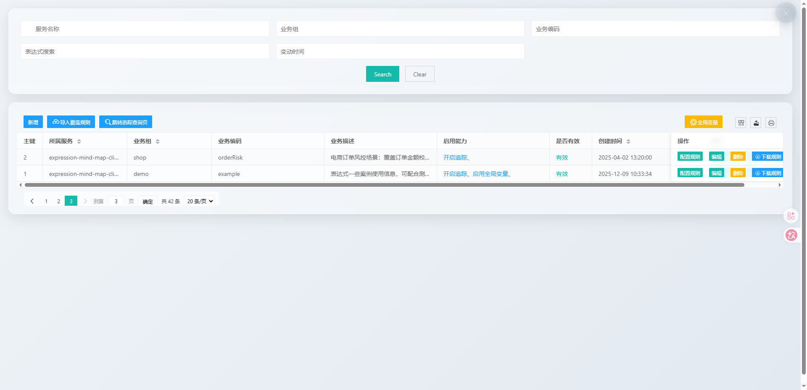
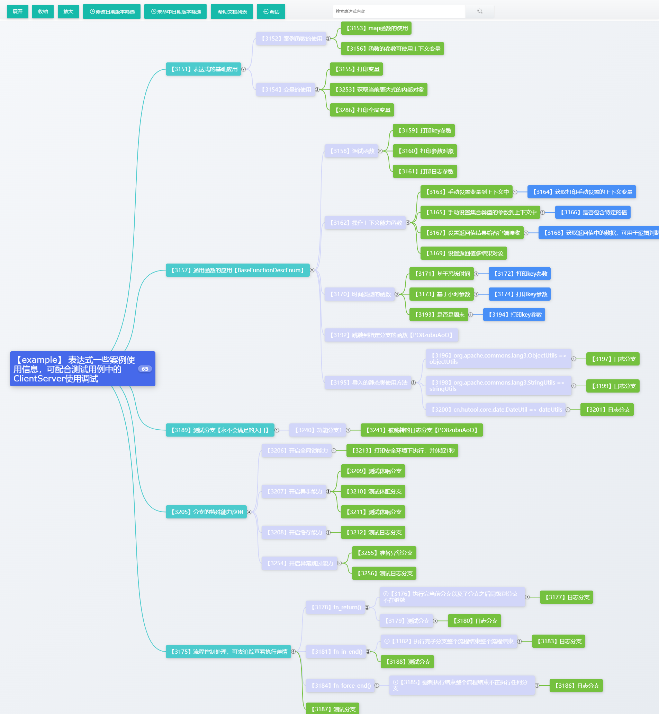
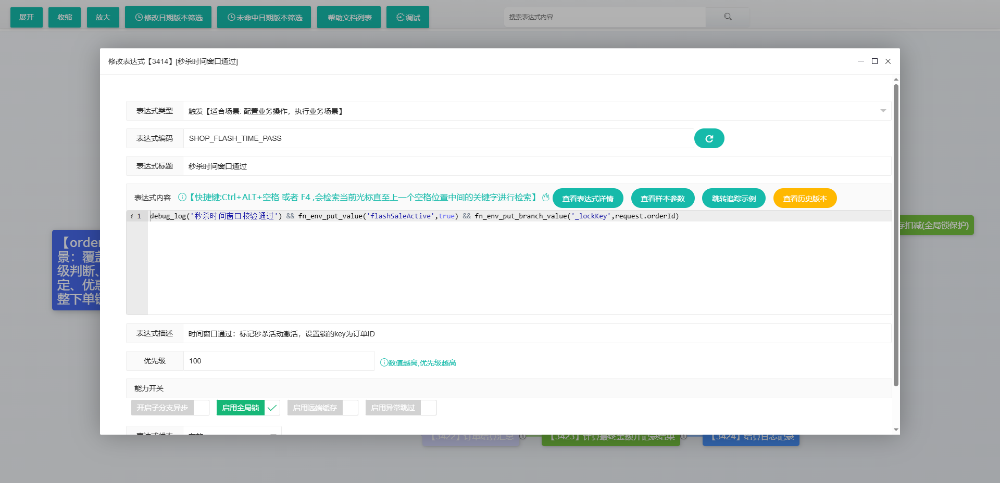
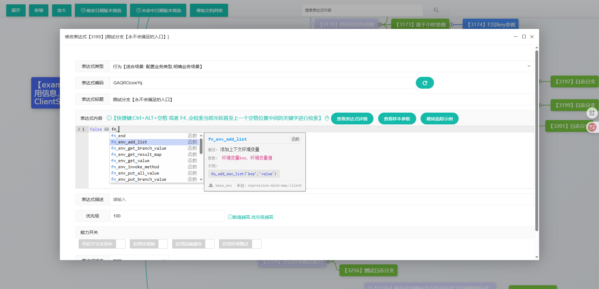
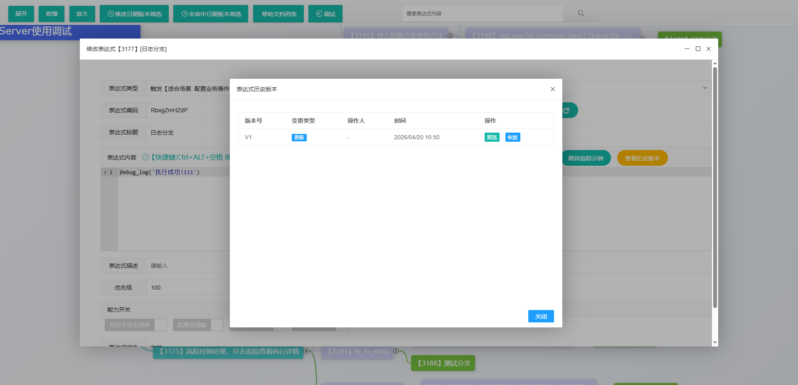

# 🚀 超灵活「表达式规则引擎」完全指南 | 动态配置+思维导图可视化+实时生效

---

一款基于`Aviator`封装可以动态配置函数和变量来形成表达式的引擎，可通过定义表达式、追踪、搜索等能力完成表达式的可视化处理流程，更直观、更灵活、简单高效的完成复杂的业务规则。

> 它可以是规则引擎负责你的局部业务场景，也可以是业务定制平台负责你的功能业务配置，也可以是能力标准化平台为你的团队赋能。它既标准又不标准，看你想怎么玩？

## 🌟 核心优势全解析

### 🔥 六大核心能力
✅ **逻辑可视化**：有什么比思维导图更清晰的逻辑梳理呢?
✅ **动态编排**：无需改代码，表达式实时配置业务规则
✅ **全链路透视**：执行过程可视化追踪、轻松定位规则执行情况
✅ **跨服务联动**：支持注册中心/IP直连，配置与执行分离部署
✅ **拓展能力**：支持自定义函数、动态变量、流程管控能力
✅ **版本管理**：表达式变更历史追踪、版本回溯对比，安全可控
✅ **客户端调试**：服务端直连客户端调试，真实环境验证规则逻辑	  

### 🛡️ 硬核技术支撑
⚡ **双版本兼容**：JDK8+SpringBoot2.x / JDK17+SpringBoot3.x 全适配  
⚡ **轻量级依赖**：仅需MySQL+Redis，5分钟快速部署  
⚡ **标准化扩展**：自定义函数/变量+流程控制（break/return/分支跳转）

---

## 🎯 五大黄金应用场景
### 1️⃣ **动态业务管控**
✨ 活动限时开关 | 用户分层可见 | 紧急熔断机制  
✨ 数据清洗过滤 | 接口接管（前置校验→业务执行→后置回调）

### 2️⃣ **业务实时重组**
💡 营销规则热更新（如双11满减策略实时调整）  
💡 功能模块插拔（抽奖次数限制动态下架）
💡 开关场景(功能下线逻辑下线)
💡 内测场景(指定日期或者指定人员触发)

### 3️⃣ **原子能力沉淀**
🔧 复用组件：日期开关 | 分布式锁 | 分支缓存| 异步执行 
🔧 业务原子化(自行研发)：黑白名单| 消息推送| 重复执行| 业务埋点 | 自行想象

### 4️⃣ **智能参数处理**
🎨 数据格式统一 | 异常参数拦截 | 上下文变量运算

### 5️⃣ **全流程监控**
📊 执行链路追踪 | 调试日志实时查看 | 规则版本对比

---

## 🛠️ 三分钟极速配置


### Step1️⃣ 规则编排

`http://localhost:20888/template/executor-list.html`  
👉 **操作技巧**：

**执行器管理**




- `Tab键`秒建子节点 | 思维导图式拖拽编排

**支持导入/导出规则（团队协作神器）**  


**操作表达式分支**


**编辑你的业务逻辑表达式**



**简单的检索能力：客户端编写的函数，会被搜索到，方便编写不易出错。**



函数变量检索:


**最近改动过的分支**


**最近没有命中过的分支**


查看表达式历史版本



### Step2️⃣ 执行优先级

```text
1、从左到右
🚩行为(确定动作) 
🚩条件(确定规则)
🚩触发(目标触发)
🚩回调(通知场景)
2、从上到下
🚩 上层 → 全局变量初始化（数据准备）  
🚩 中层 → 核心业务逻辑（主战场） 
🚩 下层 → 通用回调处理（善后大师）  
```

### Step3️⃣ 链路追踪

`http://localhost:20888/template/trace-list.html`
👉 实时查看执行日志+参数快照（带traceID精准定位）

- 追踪列表


- 追踪详情


- 查看本次请求的上下文样本参数


- 表达式远程验证调用


## 可视化业务仪表盘


> 还有很多细节功能点，这里就不一一列举了，有兴趣可以本地部署体验一下。⭐✨🎉

------

## 🏆 最佳实践案例

| 场景                                                         | 解决方案                    |
| ------------------------------------------------------------ | --------------------------- |
| [任务系统](https://blog.csdn.net/lkx444368875/article/details/146173370) | 动态配置积分规则+完成条件   |
| [转介绍活动](https://blog.csdn.net/lkx444368875/article/details/146174548) | 实时调整邀请层级/奖励系数   |
| [开屏页接口](https://blog.csdn.net/lkx444368875/article/details/146174957) | 根据用户标签返回差异化内容  |
| [抽奖系统](https://blog.csdn.net/lkx444368875/article/details/146175032) | 概率权重动态调整+黑名单拦截 |
| 后台系统结合案例（待补充）                                   | 产品配置化，后台系统配置    |

------

## 🚀 一键接入方案

### 客户端集成

📦 [5分钟接入指南](./expression-mind-map-client-starter/README.md)

### 服务端部署

⚙️[文档地址](./expression-mind-map-server/README.md)

------

## 💡 高阶玩法秘籍

### 性能调优技巧

🔹 高频规则预加载到Redis
🔹 复杂表达式拆分为原子函数，高效运用本地缓存
🔹 支持异步并行

### 安全防护策略(待完善)

🔐 敏感操作二次验证
🔐 规则变更审批流

------

## 📞 即刻启程

疑问联系方式:
🔸 技术交流：微信 `liukaixiong820` || QQ `444368875`

## ✍️关于项目

​	工作很多年了，复杂场景的设计模式各种套用始终不尽如人意，设计来设计去把自己设计进去了。
​	虽然项目最初是希望解决一些复杂多变的场景规则配置问题，但随着各种千奇百怪的定制场景，我发现它的应用不再局限于业务局部的规则配置，而是更适合业务整体的定制场景，**规则引擎**也可以演变成**业务定制平台**，比如个性化的开屏、任务系统等等各种各样的场景经过**拆解**之后，都可以通过它配置出来。而你拆解下来的逻辑演变成一个个的能力（变量函数），这些能力可以赋能其他的业务场景，最主要的是它**可视化编排、实时生效、可追踪**。当能力足够多的时候，开发工作直接转化成**配置工作，无需发版、效率飙升**。从另一个视角也可以把它看成是一个高度抽象的**能力标准化平台**，你只需要写逻辑写能力即可。

> 嗯，说的有点多。
>
> **总结就是它一看就懂，一用就会。(ps:嗯，如果还有不清楚，请联系我，我换一句。)**
>
> **如果你遇到任何复杂的场景不知道咋设计不妨用它来试一试。**
>
> `它可能不能成为你的答案，成为一种选择也无妨~`

## **🙏**技术致谢

> ### github
>
> - aviator: https://github.com/killme2008/aviatorscript
>- layui：https://layui.dev/docs/2/
> - jsmind : https://hizzgdev.github.io/jsmind/docs/zh/
> - jsmind.menu : https://github.com/allensunjian/jsmind.menu.js/blob/master/README.md

**如果你觉得该项目不错，帮忙点个赞，开源不易，感谢支持！**

