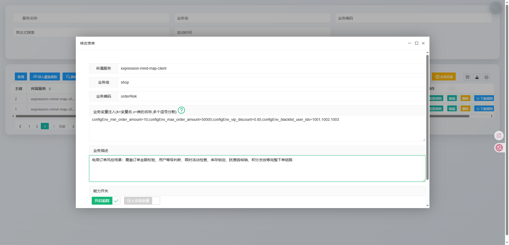
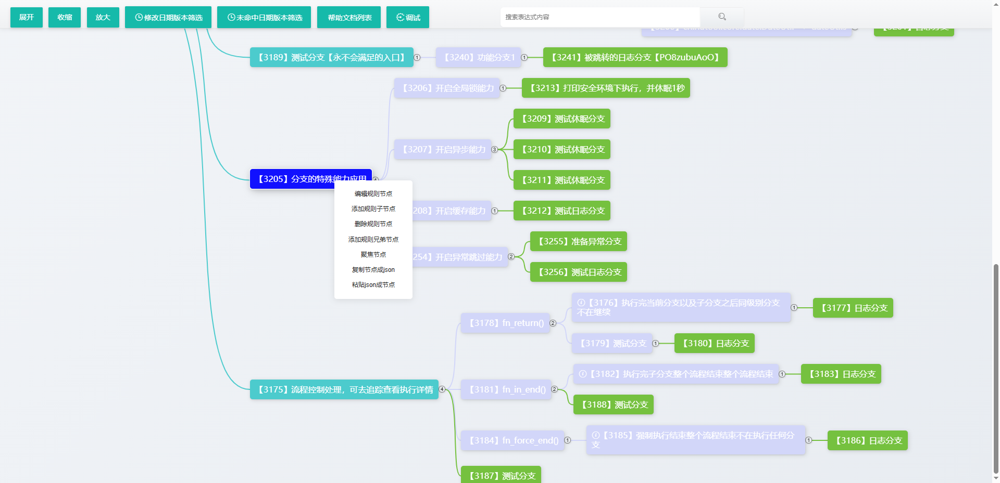
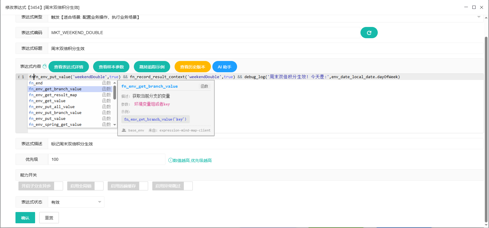
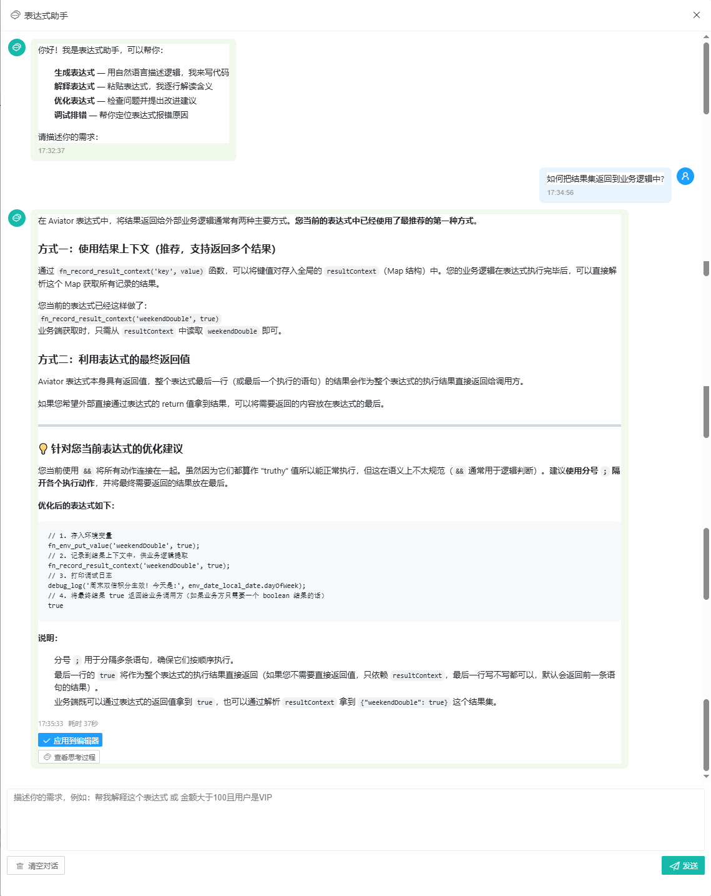
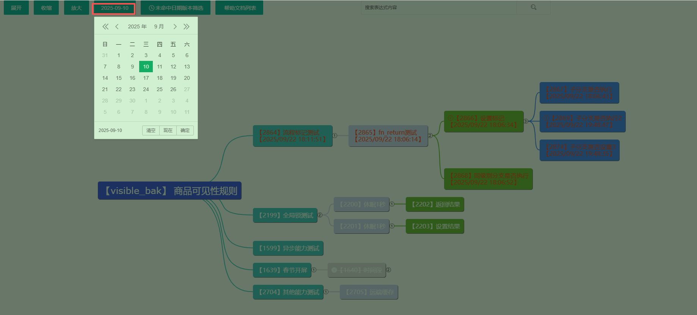
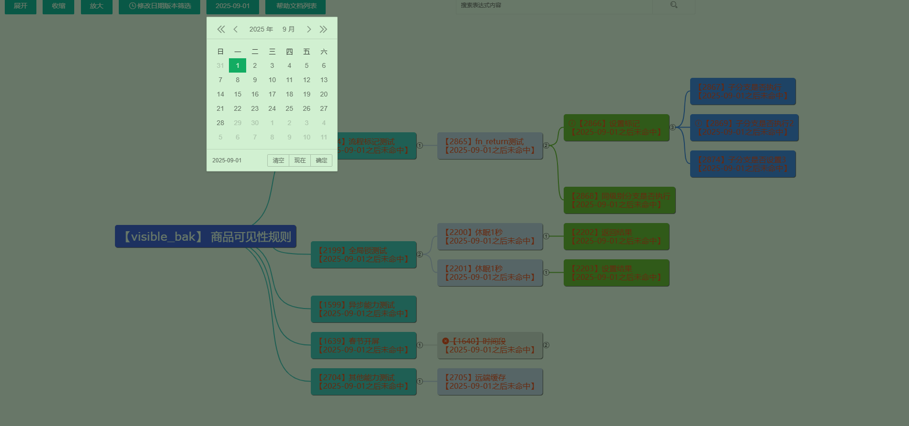
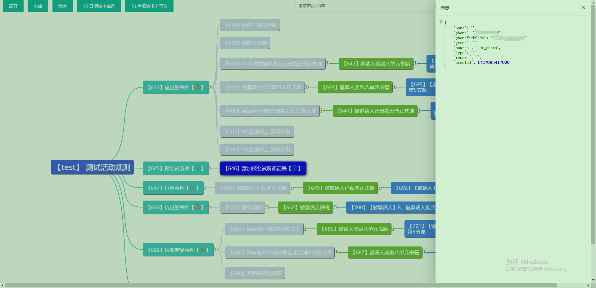
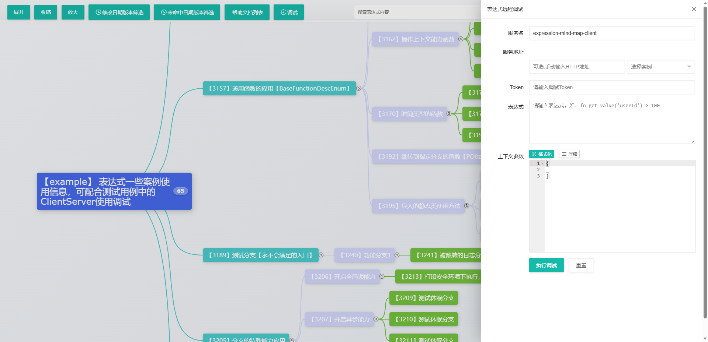
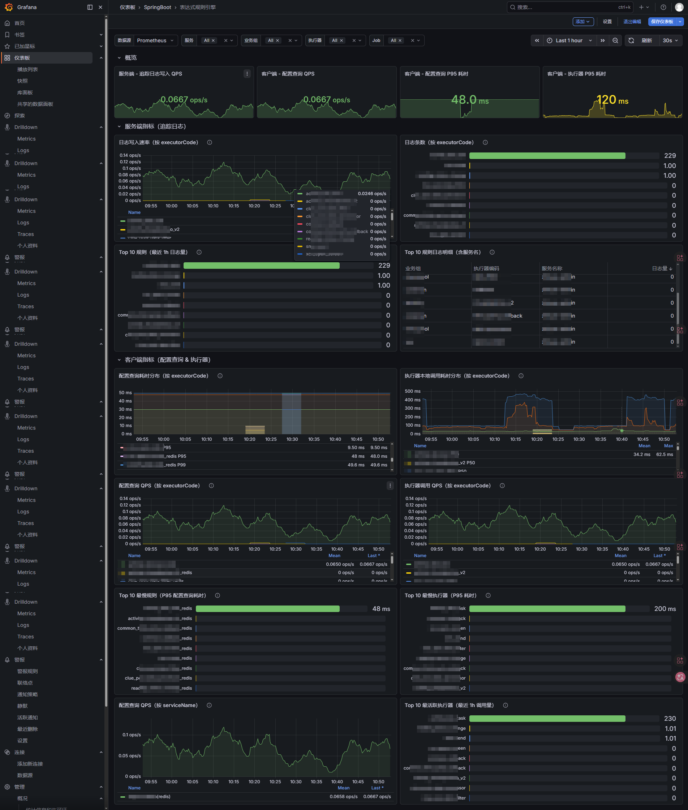

# Expression Mind Map Engine

**基于 Aviator 的可视化表达式规则引擎 | 思维导图编排 + 动态配置 + 实时生效 + 全链路追踪**

> 一款通过表达式动态配置业务规则的引擎，支持思维导图可视化编排、实时生效、全链路追踪，让复杂业务规则变得直观、灵活、高效。

## 架构概览

### 系统架构


系统采用**配置端与执行端分离**架构：服务端提供规则编排 Web UI，客户端 SDK 嵌入业务应用执行表达式规则。支持 HTTP 直连和 Redis 配置同步两种模式，可选集成 Nacos 注册中心。

### 功能架构


系统涵盖 **11 大功能模块**：执行器管理、规则配置与编辑、追踪与监控、导入导出、版本管理、调试与测试、智能提示与文档、登录鉴权、仪表盘统计、客户端 SDK、AI 表达式生成。

### 请求流程


请求从调用层进入，经过配置加载、数据准备、表达式树遍历执行，每一层均提供对应的扩展点接口。

---

## 核心优势

- **逻辑可视化**：思维导图式规则编排，直观清晰
- **动态配置**：表达式实时配置业务规则，无需改代码即时生效
- **全链路追踪**：执行过程可视化追踪，精准定位规则执行情况
- **跨服务联动**：支持注册中心/IP 直连，配置与执行分离部署
- **灵活扩展**：自定义函数、动态变量、流程管控（break/return/分支跳转）
- **AI 辅助生成**：自然语言描述即生成 Aviator 表达式，支持多轮对话、上下文自动注入、多模型切换（GLM/OpenAI/Ollama/DeepSeek）
- **版本管理**：表达式变更历史追踪、版本回溯对比，安全可控
- **客户端调试**：服务端直连客户端调试，真实环境验证规则逻辑
- **双版本兼容**：JDK8 + SpringBoot 2.x / JDK17 + SpringBoot 3.x 全适配
- **轻量部署**：仅需 MySQL + Redis，快速部署

---

## 应用场景

| 场景 | 说明 |
|------|------|
| 动态业务管控 | 活动限时开关、用户分层可见、紧急熔断、接口接管（前置校验→业务执行→后置回调） |
| 业务实时重组 | 营销规则热更新、功能模块插拔、开关场景、内测场景 |
| 原子能力沉淀 | 日期开关、分布式锁、分支缓存、异步执行、黑白名单、消息推送等 |
| 智能参数处理 | 数据格式统一、异常参数拦截、上下文变量运算 |
| 全流程监控 | 执行链路追踪、调试日志实时查看、规则版本对比 |
| AI 辅助编排 | 自然语言生成/修改表达式，自动注入函数变量上下文，支持多轮对话 |

---

## 快速开始

### 服务端部署

**前置条件**：MySQL + Redis

```bash
# 初始化数据库
mysql -u root -p < script/expression_mysql.sql

# JDK17（默认）
mvn clean install

# JDK8
mvn clean install -Pjdk8 -Djava.version=8

# 启动服务端
cd expression-mind-map-server
mvn spring-boot:run
```

启动后访问：

- 规则配置页：`http://localhost:20888/template/executor-list.html`
- 追踪日志页：`http://localhost:20888/template/trace-list.html`
- 提示词管理页：`http://localhost:20888/template/ai-prompt-list.html`
- 登录页：`http://localhost:20888/template/login.html`

### AI 表达式生成（可选）

> 详见 [服务端文档 - AI 表达式生成](./expression-mind-map-server/README.md#ai-表达式生成)

在 `application.yml` 中配置 LLM 即可通过自然语言生成/修改表达式：

```yaml
spring:
  expression:
    server:
      ai:
        enabled: true
        api-url: https://open.bigmodel.cn/api/paas/v4/chat/completions
        api-key: "your-api-key"
        model: glm-5.1
```

兼容 OpenAI / Ollama / DeepSeek 等任何 OpenAI API 格式的模型服务。

### 客户端接入

> 📦 详见 [客户端接入指南](./expression-mind-map-client-starter/README.md)

引入 `expression-mind-map-client-starter` 依赖，配置服务端地址即可：

```yaml
spring.plugin.express:
  debug: true
  remote-engine-url: http://127.0.0.1:20888
  expression-config-call: http    # http 或 redis
  enable-trace-log: true
  inject-type-package: com.xxx.service
```

---

## 界面预览

### 规则编排

| 功能 | 预览 |
|------|------|
| 思维导图编排 |  |
| 执行器管理 |  |
| 执行器详情 |  |
| 导入/导出规则 |  |
| 操作表达式分支 |  |
| 编辑业务逻辑表达式 |  |
| 智能检索（函数/变量搜索即用） |  |
| AI  助手 |  |
| 函数变量检索 |  |
| 函数详情 |  |
| 最近改动过的分支 |  |
| 最近未命中过的分支 |  |
| 表达式历史版本 |  |

> `Tab键`秒建子节点 | 思维导图式拖拽编排

### 执行优先级

| 方向 | 层级 | 职责 |
|------|------|------|
| **从左到右** | 行为 → 条件 → 触发 → 回调 | 确定动作 → 确定规则 → 目标触发 → 通知场景 |
| **从上到下** | 上层 → 中层 → 下层 | 数据准备 → 核心业务逻辑 → 通用回调处理 |

### 链路追踪

> 访问 `http://localhost:20888/template/trace-list.html`，实时查看执行日志 + 参数快照（带 traceID 精准定位）

| 功能 | 预览 |
|------|------|
| 追踪列表 |  |
| 追踪详情 |  |
| 请求上下文样本参数 |  |
| 表达式远程验证调用 |  |

### 业务仪表盘

| 功能 | 预览 |
|------|------|
| 执行器统计仪表盘 |  |

---

## 最佳实践案例

| 场景 | 解决方案 |
|------|----------|
| [任务系统](https://blog.csdn.net/lkx444368875/article/details/146173370) | 动态配置积分规则 + 完成条件 |
| [转介绍活动](https://blog.csdn.net/lkx444368875/article/details/146174548) | 实时调整邀请层级/奖励系数 |
| [开屏页接口](https://blog.csdn.net/lkx444368875/article/details/146174957) | 根据用户标签返回差异化内容 |
| [抽奖系统](https://blog.csdn.net/lkx444368875/article/details/146175032) | 概率权重动态调整 + 黑名单拦截 |

---

## 核心扩展点

### 自定义函数

继承 `AbstractSimpleFunction`：

```java
@Component
public class MyFunction extends AbstractSimpleFunction {
    @Override
    public Object processor(ExpressionEnvContext env,
                           ExpressionConfigTreeModel config,
                           ExpressionBaseRequest request,
                           List<Object> args) {
        return getArgsIndexValue(args, 0);
    }

    @Override
    public Enum<? extends ExpressFunctionDocumentLoader> documentRegister() {
        return MyFunctionEnum.MY_FUNCTION;
    }
}
```

### 自定义变量

继承 `AbstractExpressionVariableContextProcessor`：

```java
@Component
public class MyVariable extends AbstractExpressionVariableContextProcessor {
    @Override
    public Enum<? extends VariableDefinitionalService> variableName() {
        return MyVariableEnum.MY_VAR;
    }

    @Override
    public Object processor(String name, ExpressionBaseRequest request,
                           Map<String, Object> envContext) {
        return LocalDateTime.now();
    }
}
```

### 生命周期钩子

| 钩子接口 | 作用范围 |
|----------|----------|
| `ExpressionExecutorPostProcessor` | 执行器执行前后 |
| `ExpressionConfigExecutorIntercept` | 单条表达式执行拦截 |
| `ExpressionFunctionPostProcessor` | 函数执行前后 |
| `ExpressionFunctionFilter` | 函数结果修改责任链 |

---

## 性能调优建议

- 高频规则预加载到 Redis
- 复杂表达式拆分为原子函数，高效运用本地缓存
- 支持异步并行执行

---

## 关于项目

工作很多年了，复杂场景的设计模式各种套用始终不尽如人意，设计来设计去把自己设计进去了。

虽然项目最初是希望解决一些复杂多变的场景规则配置问题，但随着各种千奇百怪的定制场景，我发现它的应用不再局限于业务局部的规则配置，而是更适合业务整体的定制场景，**规则引擎**也可以演变成**业务定制平台**，比如个性化的开屏、任务系统等等各种各样的场景经过**拆解**之后，都可以通过它配置出来。而你拆解下来的逻辑演变成一个个的能力（变量函数），这些能力可以赋能其他的业务场景，最主要的是它**可视化编排、实时生效、可追踪**。当能力足够多的时候，开发工作直接转化成**配置工作，无需发版、效率飙升**。从另一个视角也可以把它看成是一个高度抽象的**能力标准化平台**，你只需要写逻辑写能力即可。

> **总结就是它一看就懂，一用就会。**
>
> **如果你遇到任何复杂的场景不知道咋设计不妨用它来试一试。**

## 联系方式


## 技术致谢

| 技术 | 地址 |
|------|------|
| Aviator | https://github.com/killme2008/aviatorscript |
| Layui | https://layui.dev/docs/2/ |
| jsMind | https://hizzgdev.github.io/jsmind/docs/zh/ |
| jsMind Menu | https://github.com/allensunjian/jsmind.menu.js |

**如果你觉得该项目不错，帮忙点个赞，开源不易，感谢支持！**