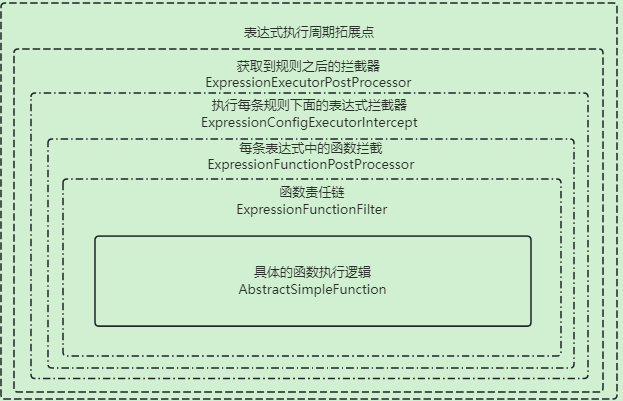

# expression-mind-map-client-starter

该工具是基于模版引擎抽象出来的通用定义，默认是基于Aviator实现，集成Spring拓展而来。该工具可以针对复杂业务进行分层、将业务模型抽象定义成变量、函数，然后通过表达式进行组装执行。

> 本质上所有表达式都存储在服务端进行管理，客户端负责从服务端进行获取规则表达式，所有逻辑都在客户端本地执行，所以不用担心性能，本质上还是业务表达式的逻辑会成为瓶颈。

## 如何使用?

引入依赖

```xml
<dependency>
     <groupId>com.liukx.expression.engine</groupId>
     <artifactId>expression-mind-map-client-starter</artifactId>
     <version>${project.version}</version>
</dependency>
```

### 配置介绍

```yaml
spring:
  plugin:
    express:
      debug: true
      remote-engine-url: http://127.0.0.1:20876    # 可直接指定服务端地址，不走注册中心查找，默认是注册中心。
      logger-trace-level: debug 				 # 默认的日志级别配置
      expression-config-call: http				 # 获取表达式配置内容的方式： http、redis ,如果服务端和客户端都处于一个redis库的话,可以考虑配置redis,减少http访问
      enable-trace-log: true					 # 是否打开追踪日志传输，关闭的话，则无法使用追踪能力
      inject-type-package: com.xxx.service.control # 注入类型包路径，该属性作用是在搜索表达式的时候，指定entity会检索到对应的属性
```

## 通用的函数


## 1、调用引擎

```java
// 注入依赖
@Resource
private ClientEngineFactory clientEngineFactory;

// 定义上下文对象
final ExpressionEnvContext expressionEnvContext = new ExpressionEnvContext();
expressionEnvContext.setEventName(eventCode);

// 将业务类注入到上下文中,方便函数或者变量获取
expressionEnvContext.addEnvClassInfo(activityConfig);
expressionEnvContext.addEnvClassInfo(shareJoinLog);

// 注入自定义变量，可在表达式中进行运用
expressionEnvContext.addEnvContext("eventCode", eventCode);

// 业务参数
ClientExpressionSubmitRequest request = new ClientExpressionSubmitRequest();
request.setBusinessCode("activity"); 	// 业务组
request.setExecutorCode(activityCode);  // 执行码
request.setEventName(eventCode);		// 事件码
request.setUserId(userId);				// 用户编号
request.setUnionId(userId + "");		// 业务编号
request.setTraceId(TraceHelper.getTraceId()); // 追踪编号
request.setRequest(activityEventModel);		 // 请求参数
// 执行表达式内容
final Boolean invoke = clientEngineFactory.invoke(request, expressionEnvContext);
```

- BusinessCode: 业务组，某个业务模块
- ExecutorCode: 执行码，可以理解为业务功能
- EventName: 事件码，当前执行的事件

以活动举例:

- BusinessCode: 活动模块
- ExecutorCode: 活动编码
- EventName: 活动内部事件 // 非必须

## 2、自定义函数

简单的函数实现`AbstractSimpleFunction` 即可

```java
public class DemoSendPointFunction extends AbstractSimpleFunction {
   
    @Override
    public Object processor(ExpressionEnvContext env, ExpressionConfigTreeModel configTreeModel, ExpressionBaseRequest request, List<Object> funArgs) {
        /*
            以下是一些常用的工具类案例使用方式
         */
        // 获取第一个参数，如果没有获取到则会抛出异常。适用于必填参数是否填写.
        Object firstArgs = getArgsIndexValue(funArgs, 0);

        // 获取第二个参数，如果没有的话，则返回默认值，适用于兼容老的函数
        Long argsIndexValue = getArgsIndexValue(funArgs, 1, 100L);

        // 从上下文变量中获取上游注入的对象：FunctionRequestDocumentModel
        // 适用于针对特定的业务模型函数获取该业务的上下文参数对象
        FunctionRequestDocumentModel documentModel = env.getObject(FunctionRequestDocumentModel.class);

        // 可以加入追踪页面可查找的日志信息
        // getName() 函数名称 ,  key : 标识  value : 日志内容
        env.recordTraceDebugContent(getName(),"key","内容");
        
        // 该函数的返回结果，可以是任意对象。表达式会基于该函数的结果继续运算
        return true;
    }

    @Override
    public Enum<? extends ExpressFunctionDocumentLoader> documentRegister() {
        // 函数名称定义,建议使用枚举类统一管理,后期可通过界面索引到对应的函数信息
        return DemoFunDescDefinitionService.SEND_POINT;
    }
	// 表达式使用 : send_point('积分编码','积分值')
}
```

函数相关的定义，涵盖`名称` 、`参数` 、`描述` 可通过`ExpressFunctionDocumentLoader` 定义，建议使用枚举类统一规范起来。

> 该类有一些可重写方法的能力：
>
> - isAllowedCache() : 表示该函数是否需要缓存，默认是true，当一连串的表达式内部调用的函数参数一模一样，则会被缓存到本地中，如果不希望开启可重写方法[比如重复触发]。
> - generateCacheKey() ：本地函数签名重写，你如果有自己的想法可以重写你想要的。
> - getArgsIndexValue() ： 获取函数的参数信息，这里没有封装，是什么类型就是什么类型。
> - getConvertValue()： 获取函数的参数信息，允许转换成特定的对象，比如传递进来的是字符串，你可以直接转成数字型等等。
> - getArgsIndexDate()： 获取函数的参数信息，直接获取时间类型的参数，你可以传递字符串、Long、Date，都会被统一转成Date
> - convertMap()：前面的方法都是参数固定的，需要一一对应，一旦有些参数对应不上可能会出问题。然后这种方法就是将函数的参数设计成Map类型，根据Key获取Value，注意必须是2的倍数比如：fun('a',1,'b','c') = map[a=1,b=c]。

#### 函数的参数描述

1. 建立函数枚举列表

```java
/**
 * 基础使用方式
 *
 * @author liukaixiong
 * @date 2023/12/7
 */
public enum DemoFunDescDefinitionService implements ExpressFunctionDocumentLoader {

    SEND_POINT("activity", "send_point", "赠送积分", new String[]{"积分编码", "积分值"}, "true || false", "send_point('aa','50')");

    private FunctionApiModel functionApiModel;

    DemoFunDescDefinitionService(String group, String code, String describe, String[] requestDesc, String returnDescribe, String example) {
        FunctionApiModel def = new FunctionApiModel();
        def.setName(code);
        def.setGroupName(group);
        def.setDescribe(describe);
        def.setResultClassType(returnDescribe);
        def.setArgs(Arrays.asList(requestDesc));
        def.setExample(example);
        this.functionApiModel = def;
    }

    @Override
    public FunctionApiModel loadFunctionInfo() {
        return this.functionApiModel;
    }
}

```

## 通用函数列表【BaseFunctionDescEnum】

| 函数类型      | 函数名称                                             | 函数作用                                                     |
| ------------- | ---------------------------------------------------- | ------------------------------------------------------------ |
| 流程分支控制  | fn_in_end()                                          | 执行当前分支的内部子分支流程之后结束                         |
| 流程分支控制  | fn_force_end()                                       | 满足当前节点，则直接结束流程，不在往下执行                   |
| 流程分支控制  | fn_return()                                          | 返回到上层分支，同级别分支不在继续                           |
| 调试函数      | debug_body()                                         | 追踪链路中打印请求参数体                                     |
| 调试函数      | debug_object()                                       | 追踪链路页面中：打印指定的参数对象                           |
| 条件-时间类型 | fn_sys_date_hour_range(9,20)                         | 是否在小时时间范围处理(基于系统时间)                         |
| 条件-时间类型 | fn_sys_date_day_range('2024-08-21','2024-08-25')     | 是否在当前日期范围内，允许传递第3个参数为时间类型,默认系统时间 |
| 上下文设置    | fn_record_result_context('result','abc')             | 将变量设置到结果对象【resultMap】中，返回值中会体现。        |
| 上下文设置    | fn_put_value('key','value')                          | 将变量设置到当前上下文中，供所有表达式使用                   |
| 上下文设置    | fn_get_value('key')                                  | 获取当前上下文中的变量的值                                   |
| 上下文设置    | fn_add_env_list('key','value')                       | 将变量添加一个集合到上下文中，有则追加，没有则初始化并加入   |
| 对象操作      | fn_object_is_not_null(xxx1,xxx2)                     | 判断值是否为空,允许传递多个值,请传递变量                     |
| 变量操作      | fn_env_invoke_method(obj,'xxMethod',seq.list(1,2,3)) | 执行变量中对应的方法，比如变量是一个对象，需要调用它的方法。 |

> 你可以根据自己的想法制定想要的能力，在表达式中注入即可。通用实现类在: `com.liukx.expression.engine.client.function`中

## 3、自定义变量 ExpressionVariableRegister

变量可以分为静态和动态两种方式:

- 静态变量是直接在调用引擎的时候，将值设置到上下文中，比如： `ExpressionEnvContext`
    - `expressionEnvContext.addEnvContext("eventCode", eventCode)`
    - 还有一种方式就是在创建执行器的时候，可通过页面方式直接配置变量
- 动态变量：在表达式中指定，表达式解析完成之后会调用`ExpressionVariableRegister` 进行查找匹配，找到之后会放入上下文中。
    - 来源可以从数据库、内调调用、第三方调用，根据自己的业务逻辑实现即可。
    - 

通过实现`ExpressionVariableRegister`接口即可。建议变量的管理和枚举进行绑定，比如：

### 3.1 抽象业务变量

```java
/**
 * 获取当前系统时间
 *
 * @code env_date_local_date.year       获取年份
 * @code env_date_local_date.monthValue 获取月份
 * @code env_date_local_date.dayOfMonth 获取月份第几天
 * @code env_date_local_date.hour   获取当前小时数
 * @code env_date_local_date.minute 获取当前分钟数
 * @author liukaixiong
 * @date 2025/2/27 - 15:51
 */
@Component
public class BaseEnvDateLocalDateTimeVariable extends AbstractExpressionVariableContextProcessor {

    @Override
    public Enum<? extends VariableDefinitionalService> variableName() {
        // 可自行定义
        return BaseVariableEnums.env_date_local_date_time;
    }

    @Override
    public Object processor(String name, ExpressionBaseRequest request, Map<String, Object> envContext) {
        // 自行实现变量逻辑
        return LocalDateTime.now();
    }
}
```

枚举管理: 将所有变量维护到该类中，请实现`VariableDefinitionalService` 接口，包括变量定义、描述，出参类型，可方便后续检索。

```java
@Getter
public enum BaseVariableEnums implements VariableDefinitionalService {
    env_date_local_date_time("获取LocalDate对象", LocalDate.class),
    ;


    private final String desc;
    private final Class<?> returnType;

    BaseVariableEnums(String desc, Class<?> returnType) {
        this.desc = desc;
        this.returnType = returnType;
    }


    @Override
    public String getVariableName() {
        return this.name();
    }

    @Override
    public String getVariableDescription() {
        return getDesc();
    }

    @Override
    public Class<?> getVariableReturnType() {
        return getReturnType();
    }
}
```

```java
@Component
public class UserEnvVariableRegister extends AbstractExpressionVariableContextProcessor {

    @Resource
    private IXService service;

    @Override
    public BaseVariableEnums variableName() {
        return BaseVariableEnums.env_user_obj;
    }

    @Override
    public Object processor(String name, ExpressionBaseRequest request, Map<String, Object> envContext) {
        final Long userId = getUser(name, request, envContext);
        return service.getById(userId);
    }

    protected Long getUser(String name, ExpressionBaseRequest request, Map<String, Object> envContext) {
        return request.getUserId();
    }

}
```

### 3.2 数据库变量

可自定义实现即可

```java
// 注入bean
public class DemoEnvRegister implements ExpressionVariableRegister {

    @Override
    public List<VariableApiModel> loadVariableList() {
        // 如果有多个变量,则返回多个
        return null;
    }

    @Override
    public VariableApiModel getVariableInfo(String group, String name) {
        // 定义变量信息
        return null;
    }

    @Override
    public boolean finderVariable(String name) {
        // 查询数据库是否存在
        return false;
    }

    @Override
    public Object invoke(String name, ContextTemplateRequest cache) {
        // 处理业务逻辑
        return null;
    }

    @Override
    public String groupName() {
        return "db";
    }
}
```

## 4. 表达式生命周期



> 执行过程： 执行器 -> 表达式 -> 函数|变量

| **阶段**        | **接口/类名**                       | **触发时机**     | **作用**                         | 默认实现                                                     |
| --------------- | ----------------------------------- | ---------------- | -------------------------------- | ------------------------------------------------------------ |
| 执行器执行前/后 | `ExpressionExecutorPostProcessor`   | 获取规则前后     | 全局预处理、结果变更             | ExpressionConfigIdFilterSupport: 表达式筛选。ExpressionVarConfigRegisterSupport - 配置变量注入TraceSwitchConfigurabilityProcessor: 执行器能力触发执行 |
| 单条表达式执行  | `ExpressionConfigExecutorIntercept` | 每条表达式执行时 | 表达式级拦截（链路追踪）         | ExecutorTraceCollectIntercept - 收集表达式日志               |
| 函数执行前后    | `ExpressionFunctionPostProcessor`   | 每个函数调用时   | 记录日志、异常处理               | ExecutorTraceCollectIntercept - 收集表达式日志               |
| 函数责任链      | `ExpressionFunctionFilter`          | 函数执行前后     | 强制修改参数或结果（如兜底逻辑） | ExpressionFunctionNameFilterSupport : 过滤函数名称，替换函数结果 |
| 远端调用        | RemoteExpressionConfigService       | 获取规则         | 获取执行器和表达式配置信息       | HttpExpressionConfigService、RedisExpressionConfigService、HttpCacheExpressionConfigService |
